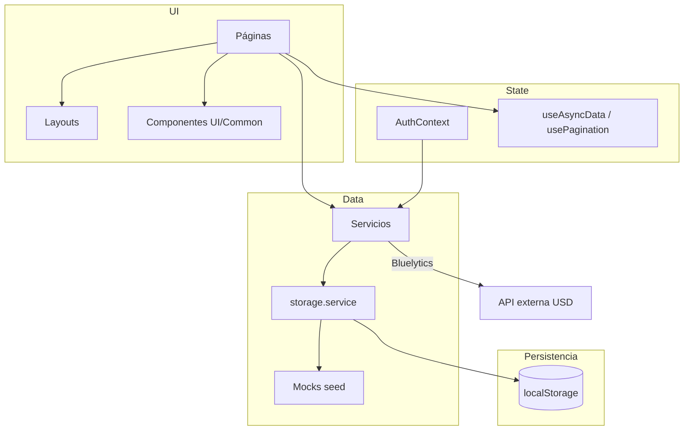
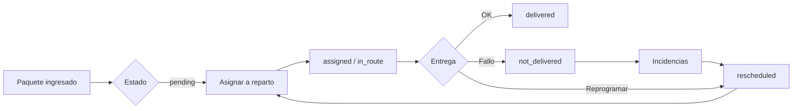

# Miacargo Logística — Documentación del proyecto

> Documento de contexto para desarrollo y asistencia con IA.  
> Última actualización: julio 2026 · versión demo `1.0.0-demo`

---

## Resumen

**Miacargo Logística V1** es un frontend demo de operación logística interna para Argentina. Simula el ciclo completo de última milla: ingreso de paquetes, armado de repartos, seguimiento por chofer, incidencias e historial.

| Aspecto | Detalle |
|---------|---------|
| Tipo | SPA frontend, sin backend real |
| Persistencia | `localStorage` con datos mock seed |
| Auth | Simulada (email/contraseña contra usuarios locales) |
| Idioma | Español (Argentina) |
| Moneda | USD (precio/kg) + ARS (total convertido) |

### Lo que NO tiene

- Backend ni base de datos real
- Autenticación segura (contraseñas en texto plano en localStorage)
- Integración con APIs de logística reales (excepto cotización USD)
- Tests automatizados

### Lo que SÍ tiene

- CRUD completo de paquetes, repartos, choferes, vehículos y correos
- Vista mobile-first para choferes
- Escáner de códigos SH / barras
- Integración con Google Maps (links externos, no SDK embebido)
- Cotización USD en vivo vía [Bluelytics](https://bluelytics.com.ar/)
- Design System documentado en `/design-system`

---

## Cómo ejecutar

```bash
npm install
npm run dev      # http://localhost:5173
```

### Ver en el celular (misma Wi‑Fi)

El servidor de desarrollo expone la app en la red local (`server.host: true` en `vite.config.ts`).

1. Mac y celular conectados al **mismo Wi‑Fi**.
2. Ejecutar `npm run dev`.
3. En la terminal, Vite muestra una URL **Network** (ej. `http://192.168.x.x:5173`). Abrila en el navegador del celular.
4. Si no aparece la IP: `ipconfig getifaddr en0` (Mac por Wi‑Fi).
5. Login demo chofer: `chofer@miacargo.com.ar` / `demo123`.

**Nota:** los datos en `localStorage` del celular son independientes de los de la Mac. Si macOS pide permiso de firewall para Node/Terminal, aceptalo.

**Importante:** no copiar `node_modules` entre PCs (especialmente Windows → Mac). Siempre reinstalar con `npm install`.

Scripts disponibles:

| Script | Comando | Descripción |
|--------|---------|-------------|
| `dev` | `vite` | Servidor de desarrollo |
| `build` | `tsc -b && vite build` | Build de producción |
| `preview` | `vite preview` | Previsualizar build |
| `lint` | `oxlint` | Linter |

No existe script `start`. Usar `npm run dev`.

---

## Stack tecnológico

| Capa | Tecnología |
|------|------------|
| UI | React 19 |
| Lenguaje | TypeScript 6 (strict) |
| Build | Vite 6 |
| Estilos | Tailwind CSS v4 (`@tailwindcss/vite`) |
| Routing | React Router DOM v7 |
| Formularios | React Hook Form + Zod v4 |
| Iconos | Lucide React |
| Toasts | Sonner |
| Fechas | date-fns (locale `es`) |
| Lint | oxlint |

### Configuración clave

- **Alias de paths:** `@/` → `src/` (vite.config.ts + tsconfig)
- **Tailwind:** tokens en `src/index.css` vía `@theme`
- **Fuente:** Inter (cargada en `index.html`)
- **Colores de marca:** primary `#20B9B5` (teal), secondary `#3F3568` (violeta)

---

## Estructura de carpetas

```
MiaCargo/
├── docs/
│   └── PROJECT.md          ← este archivo
├── src/
│   ├── main.tsx            # Entry point React
│   ├── App.tsx             # Router principal
│   ├── index.css           # Tailwind + design tokens
│   │
│   ├── assets/             # Logo, imágenes estáticas
│   ├── components/
│   │   ├── ui/             # Primitivos reutilizables (22 componentes)
│   │   └── common/         # Componentes con lógica de dominio (5)
│   ├── constants/          # Labels, colores, navegación, storage keys
│   ├── contexts/           # AuthContext
│   ├── hooks/              # useAsyncData, usePagination
│   ├── layouts/            # AppLayout (admin), DriverLayout (chofer)
│   ├── mocks/              # Datos seed iniciales
│   ├── pages/              # Páginas por ruta
│   │   └── driver/         # Páginas exclusivas del chofer
│   ├── routes/             # ProtectedRoute, PublicOnlyRoute
│   ├── schemas/            # Validación Zod (formularios)
│   ├── services/           # Capa de datos (localStorage)
│   ├── types/              # Tipos TypeScript del dominio
│   └── utils/              # Helpers (fecha, dinero, maps, etc.)
│
├── package.json
├── vite.config.ts
├── tsconfig.json
└── README.md
```

---

## Arquitectura



### Flujo de datos

1. Cada servicio llama a `storageService.seedIfNeeded()` antes de leer/escribir.
2. Si la versión en localStorage no coincide con `MOCK_DATABASE_VERSION`, se resetea la DB mock.
3. Las mutaciones escriben en localStorage y, cuando corresponde, registran en `historyService`.
4. Todos los métodos de servicio usan `delay()` (200–500 ms) para simular latencia de red.
5. Las páginas son delgadas: lógica de negocio en servicios, validación en Zod, UI en componentes.

---

## Roles y autenticación

### Roles

| Rol | Home | Acceso |
|-----|------|--------|
| `admin` | `/dashboard` | Todo: operaciones + flota + configuración + design system |
| `operator` | `/dashboard` | Operaciones: paquetes, repartos, escáner, incidencias, historial |
| `driver` | `/driver` | Solo vista mobile de repartos asignados |

### Credenciales demo

Contraseña para todos: `demo123`

| Rol | Email |
|-----|-------|
| Administrador | admin@miacargo.com.ar |
| Operador | operador@miacargo.com.ar |
| Chofer | chofer@miacargo.com.ar |

En `/login` también hay botones de acceso rápido por rol (`loginAsRole`).

### Flujo de auth

```
LoginPage
  → authService.login() o loginAsRole()
  → valida contra users en localStorage
  → guarda Session en localStorage
  → redirect a getHomePath(role)

ProtectedRoute:
  - sin sesión → /login
  - rol incorrecto → home del usuario
  - canAccess(path, role) falla → home del usuario

PublicOnlyRoute:
  - con sesión activa → redirect al home del rol
```

### Session

```typescript
interface Session {
  userId: string
  email: string
  name: string
  role: UserRole
  driverId?: string   // solo choferes, vincula User → Driver
  loggedAt: string
}
```

---

## Rutas

### Admin / Operador (`AppLayout`)

| Ruta | Página | Roles |
|------|--------|-------|
| `/login` | LoginPage | público |
| `/dashboard` | DashboardPage | admin, operator |
| `/scanner` | ScannerPage | admin, operator |
| `/packages` | PackagesPage | admin, operator |
| `/deliveries` | DeliveriesPage | admin, operator |
| `/deliveries/new` | DeliveryFormPage | admin, operator |
| `/deliveries/:id` | DeliveryDetailPage | admin, operator |
| `/deliveries/:id/edit` | DeliveryFormPage | admin, operator |
| `/incidents` | IncidentsPage | admin, operator |
| `/drivers` | DriversPage | admin |
| `/vehicles` | VehiclesPage | admin |
| `/couriers` | CouriersPage | admin |
| `/history` | HistoryPage | admin, operator |
| `/settings` | SettingsPage | admin |
| `/design-system` | DesignSystemPage | admin |
| `*` | redirect → `/dashboard` | — |

### Chofer (`DriverLayout`, mobile-first)

| Ruta | Página |
|------|--------|
| `/driver` | DriverHomePage — lista de repartos del día |
| `/driver/deliveries/:id` | DriverDeliveryPage — paradas y acciones |
| `/driver/profile` | DriverProfilePage — datos de sesión |

---

## Modelo de dominio

### Entidades principales

#### Package (Paquete)

Representa un envío individual.

- **Identificadores:** `shCode` (ej. SH10001), `barcode`
- **Destinatario:** nombre, teléfono, dirección completa
- **Destino:** `destinationType` → `caba` | `gba` | `interior`
- **Pricing:** `weight`, `pricePerKgUsd`, `usdRate`, `totalUsd`, `totalArs`
- **Estados:** `pending` → `assigned` → `in_route` → `delivered` | `not_delivered` | `rescheduled` | `cancelled`
- **Pago:** `paid` | `cash` | `pending`
- **Fallo:** `failureReasonId`, `failureNotes`, `lastAttemptAt`
- **Relación:** `deliveryId` (reparto asignado)

#### Delivery (Reparto)

Representa una ronda de entregas.

- **Código:** `REP-{año}-{001}` (auto-generado)
- **Canal:** `last_mile` (puerta a puerta) | `courier` (sucursal de correo)
- **Asignaciones:** `driverId`, `vehicleId`, `courierId` (obligatorio si canal = courier)
- **Estados:** `draft` → `prepared` → `in_progress` → `completed` | `cancelled`
- **Paradas:** `stops[]` con orden, packageId y status por parada

#### DeliveryStop

```typescript
interface DeliveryStop {
  packageId: string
  order: number
  status: 'pending' | 'delivered' | 'not_delivered' | 'skipped'
  attemptedAt?: string
  notes?: string
}
```

#### Otras entidades

| Entidad | Descripción |
|---------|-------------|
| `User` | Usuario del sistema (admin/operator/driver) |
| `Driver` | Chofer de flota (vinculado a User vía `driverId`) |
| `Vehicle` | Vehículo con patente y capacidad |
| `Courier` | Sucursal de correo (Correo Argentino, Andreani, OCA, Via Cargo) |
| `FailureReason` | Motivo de no entrega |
| `HistoryEntry` | Registro de auditoría |

### Estados y transiciones clave

**Paquete → Reparto:** solo paquetes `pending`, `rescheduled` o `not_delivered` que no estén en otro reparto activo (`canAddToDelivery`).

**Reparto → Paquetes:** al cambiar estado del reparto, `syncPackagesForDelivery` alinea los estados de los paquetes.

**No entrega:** requiere `failureReasonId`. El paquete queda en `not_delivered`.

**Reprogramar:** saca el paquete del reparto actual, status `rescheduled`, disponible para un nuevo reparto.

---

## Capa de servicios

| Servicio | Responsabilidad |
|----------|-----------------|
| `storage.service` | Persistencia central, seed, normalización, versionado |
| `auth.service` | Login, logout, sesión |
| `packages.service` | CRUD paquetes, métricas, reglas de asignación |
| `deliveries.service` | CRUD repartos, paradas, métricas dashboard, sync de estados |
| `drivers.service` | CRUD choferes |
| `vehicles.service` | CRUD vehículos |
| `couriers.service` | CRUD correos |
| `history.service` | Auditoría append-only |
| `scanner.service` | Búsqueda por código + historial (últimos 10) |
| `settings.service` | Info de DB, restaurar/limpiar demo |
| `exchange.service` | Cotización USD (Bluelytics + fallback 1501 ARS) |

### Persistencia (`localStorage`)

**Versión actual:** `MOCK_DATABASE_VERSION = 8`

Si cambiás el schema de los mocks o entidades, incrementá esta constante en `src/constants/storage.ts` para forzar re-seed en todos los browsers.

**Keys:**

```
miacargo:db-version
miacargo:users
miacargo:packages
miacargo:deliveries
miacargo:drivers
miacargo:vehicles
miacargo:couriers
miacargo:history
miacargo:failure-reasons
miacargo:session
miacargo:scanner-history
```

**Normalizaciones al leer datos legacy:**

- Status `returned` → `not_delivered`
- Defaults de `pricePerKgUsd` (8) y `usdRate` (1501) si faltan
- `courierId` solo se mantiene si `channel === 'courier'`

---

## Datos mock (seed)

Definidos en `src/mocks/`. `createInitialDatabase()` retorna un `DatabaseSnapshot` completo.

| Colección | Archivo | Cantidad |
|-----------|---------|----------|
| Users | `users.mock.ts` | 6 (1 admin, 2 operadores, 3 choferes) |
| Packages | `packages.mock.ts` | 80 (30 CABA + 30 GBA + 20 Interior) |
| Deliveries | `deliveries.mock.ts` | 7 (varios estados y canales) |
| Drivers | `drivers.mock.ts` | 3 |
| Vehicles | `vehicles.mock.ts` | 3 |
| Couriers | `couriers.mock.ts` | 4 |
| Failure reasons | `failureReasons.mock.ts` | 7 |
| History | `history.mock.ts` | entradas de ejemplo |

Los paquetes usan direcciones argentinas reales (geocodificables en Google Maps). Algunas incluyen Piso/Depto que se sanitizan para Maps vía `sanitizeAddressForMaps`.

---

## Páginas y funcionalidades

### Dashboard (`/dashboard`)

KPIs operativos: paquetes por estado, repartos activos, historial reciente, desglose por destino. Links rápidos a secciones.

### Escáner (`/scanner`)

Busca paquete por código SH o barcode. Permite agregar a reparto activo. Guarda historial de últimos 10 escaneos.

### Paquetes (`/packages`)

CRUD completo con filtros, paginación y cotización USD en vivo. Muestra totales de pago (paid/cash/pending).

### Repartos (`/deliveries`)

Lista con filtros por estado/zona/canal. Acciones: ver detalle, editar, duplicar, cambiar estado, abrir ruta en Google Maps, totales de efectivo a cobrar.

### Formulario de reparto (`/deliveries/new`, `/deliveries/:id/edit`)

Asignar chofer, vehículo, zona, canal, paquetes disponibles. Validación: `courierId` obligatorio si canal = courier.

### Detalle de reparto (`/deliveries/:id`)

Vista completa del reparto con paradas ordenadas, progreso, acciones de estado.

### Incidencias (`/incidents`)

Paquetes con status `not_delivered` o `rescheduled`. Acciones: reprogramar, corregir dirección, cancelar.

### Choferes / Vehículos / Correos

CRUD admin con tablas, modales y validación Zod.

### Historial (`/history`)

Log de auditoría filtrable por entidad, acción y fecha.

### Configuración (`/settings`)

Versión de DB, conteo de entidades, restaurar/limpiar/recargar datos demo.

### Design System (`/design-system`)

Showcase de componentes UI, paleta de colores, badges de estado. Solo admin.

---

## Vista del chofer

Layout mobile-first (`max-width: lg`), sin sidebar.

### Home (`/driver`)

- Repartos del `driverId` de la sesión
- Barra de progreso, contadores pendiente/entregado
- Resumen de efectivo a cobrar
- Diferenciación last mile vs courier

### Detalle de reparto (`/driver/deliveries/:id`)

- Lista de paradas ordenadas con highlight en la siguiente
- **Last mile:** link a Google Maps con ruta round-trip desde hub Mercado Central
- **Courier:** destino único (sucursal del correo)
- Por parada: abrir Maps, marcar entregado, reprogramar (solo last mile), marcar no entregado (modal con motivo obligatorio)
- Info de pago: pagado / cobrar efectivo / pendiente con montos ARS
- Links `tel:` al destinatario

### Perfil (`/driver/profile`)

Datos de sesión en solo lectura.

---

## Componentes

### `components/ui/` — Design system (genéricos)

`Alert`, `Badge`, `Button`, `Card`, `Checkbox`, `ConfirmDialog`, `DateField`, `Drawer`, `DropdownMenu`, `EmptyState`, `IconButton`, `Input`, `MetricCard`, `Modal`, `PageHeader`, `Pagination`, `ScannerInput`, `SearchInput`, `Select`, `Skeleton`, `StatusBadge`, `Table`, `Textarea`

Convenciones:
- `forwardRef` donde aplica
- Clases con `cn()` (clsx + tailwind-merge)
- Variantes en props (`Button`: primary/secondary/outline/ghost/danger)
- Border radius: `[10px]` / `[12px]`

### `components/common/` — Dominio compartido

| Componente | Uso |
|------------|-----|
| `BackLink` | Navegación atrás |
| `BrandLogo` | Logo sidebar (modo colapsado) |
| `PackagePaymentInfo` | Badges y totales de pago |
| `SidebarNav` | NavLinks con estilo activo |
| `TableActions` | Botones/links de acción en filas |

---

## Validación (Zod)

Definida en `src/schemas/index.ts`:

| Schema | Uso |
|--------|-----|
| `packageSchema` | CRUD paquetes |
| `deliverySchema` | Form reparto (courierId condicional) |
| `courierSchema` | CRUD correos |
| `driverSchema` | CRUD choferes |
| `vehicleSchema` | CRUD vehículos |
| `loginSchema` | Login |
| `failureSchema` | No entrega (motivo obligatorio) |

Cada schema exporta su tipo `*FormValues` vía `z.infer`.

---

## Utilidades

| Archivo | Funciones |
|---------|-----------|
| `utils/cn.ts` | `cn()` — merge de clases Tailwind |
| `utils/date.ts` | Formato ISO, fechas en español, labels relativos (Hoy/Ayer/Mañana) |
| `utils/money.ts` | `calculatePackageTotals`, `formatUsd`, `formatArs`, `roundMoney` |
| `utils/maps.ts` | Hub default (Mercado Central), sanitización de direcciones, URLs Google Maps |
| `utils/id.ts` | `createId(prefix)` → `{prefix}_{uuid}` |
| `utils/delay.ts` | Latencia simulada para servicios |

---

## Hooks custom

### `useAsyncData(loader, deps)`

Carga async con estados `loading`, `error`, `data` y función `reload()`. No usa React Query.

### `usePagination(items, pageSize)`

Paginación client-side para tablas.

---

## Constantes

### Labels (`src/constants/labels.ts`)

Etiquetas en español para todos los enums: estados de paquete, reparto, pago, destino, canal, rol.

También define:
- `ACTIVE_DELIVERY_STATUSES`: draft, prepared, in_progress
- `INCIDENT_PACKAGE_STATUSES`: not_delivered, rescheduled

### Colores (`src/constants/colors.ts`)

Objeto JS espejo de los tokens CSS (para swatches en Design System).

### Navegación (`src/constants/navigation.ts`)

`adminNavItems`, `driverNavItems`, `getHomePath()`, `canAccess()`.

---

## Convenciones de código

1. **Imports:** siempre con alias `@/...`
2. **Páginas:** default export; layouts, routes, contexts y services: named export
3. **Formularios:** React Hook Form + `zodResolver` + toasts Sonner
4. **Listas:** `Table` genérico con `TableColumn<T>` + `usePagination`
5. **Lógica de negocio:** en servicios, no en páginas
6. **TypeScript:** strict, unions discriminadas para estados, tipos inferidos de Zod
7. **Responsive admin:** sidebar colapsable + drawer mobile
8. **Maps:** solo URLs externas a Google Maps, sin SDK
9. **Versionado de DB:** incrementar `MOCK_DATABASE_VERSION` al cambiar schema de mocks

---

## Integraciones externas

| Integración | Uso | Fallback |
|-------------|-----|----------|
| Bluelytics API | Cotización USD en `/packages` | 1501 ARS |
| Google Maps | Links de navegación/ruta | — |

---

## Diagrama de flujo operativo



---

## Notas para mantenimiento

### Cambiar datos demo

1. Editar archivos en `src/mocks/`
2. Incrementar `MOCK_DATABASE_VERSION` en `src/constants/storage.ts`
3. En el browser: ir a `/settings` → "Recargar datos demo", o limpiar localStorage

### Agregar una nueva página admin

1. Crear página en `src/pages/`
2. Agregar ruta en `App.tsx` dentro del grupo `ProtectedRoute roles={['admin', 'operator']}`
3. Si necesita nav: agregar item en `adminNavItems` (`src/constants/navigation.ts`)
4. Actualizar `canAccess()` si la ruta tiene restricciones especiales

### Agregar entidad al dominio

1. Tipo en `src/types/index.ts`
2. Mock en `src/mocks/`
3. Getter/setter en `storage.service.ts`
4. Servicio dedicado siguiendo patrón existente
5. Schema Zod si tiene formulario
6. Incrementar `MOCK_DATABASE_VERSION`

### Build de producción

```bash
npm run build    # genera dist/
npm run preview  # sirve dist/ localmente
```

---

## Referencia rápida de archivos clave

| Archivo | Para qué sirve |
|---------|----------------|
| `src/App.tsx` | Definición de todas las rutas |
| `src/contexts/AuthContext.tsx` | Estado de sesión global |
| `src/services/storage.service.ts` | Corazón de persistencia |
| `src/services/deliveries.service.ts` | Lógica más compleja (estados, sync) |
| `src/types/index.ts` | Contrato de datos del dominio |
| `src/schemas/index.ts` | Validación de formularios |
| `src/constants/storage.ts` | Versión DB y keys |
| `src/constants/navigation.ts` | RBAC por ruta |
| `src/mocks/index.ts` | Punto de entrada del seed |
| `src/index.css` | Design tokens Tailwind |
