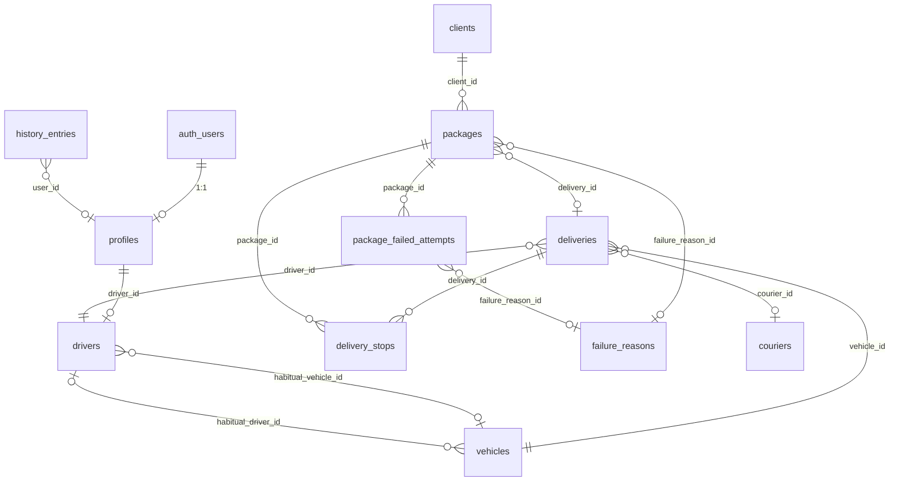

# Esquema Supabase — MiaCargo Logística

> Referencia de tablas PostgreSQL para migrar el frontend demo (hoy en `localStorage`) a **Supabase**.  
> Basado en `src/types/index.ts` y servicios actuales · versión app demo `1.0.0-demo` · schema lógico v21.

**Convención:** los nombres de tablas, columnas, enums y SQL van en **inglés**. Las explicaciones están en **español**.

---

## Resumen

| Colección actual (`localStorage`) | Tabla Supabase | Notas |
|-----------------------------------|----------------|-------|
| `miacargo:users` | `profiles` + **Supabase Auth** | No guardar contraseñas en Postgres |
| `miacargo:persons` | `clients` | En la UI: **Clientes** · en Postgres: tabla **`clients`** |
| `miacargo:packages` | `packages` | Entidad central |
| *(embebido en packages)* | `package_failed_attempts` | Hoy es `failedAttempts[]` en JSON |
| `miacargo:deliveries` | `deliveries` | Cabecera del reparto |
| *(embebido en deliveries)* | `delivery_stops` | Hoy es `stops[]` en JSON |
| `miacargo:drivers` | `drivers` | Choferes de flota |
| `miacargo:vehicles` | `vehicles` | Vehículos |
| `miacargo:couriers` | `couriers` | Sucursales de correo |
| `miacargo:failure-reasons` | `failure_reasons` | Catálogo de motivos |
| `miacargo:history` | `history_entries` | Auditoría append-only |
| `miacargo:session` | — | Reemplazado por JWT de Auth |
| `miacargo:scanner-history` | `scanner_scans` *(opcional)* | Por usuario, últimos N escaneos |
| `miacargo:notifications-last-seen` | `user_preferences` *(opcional)* | Timestamp por usuario |

**Total recomendado:** 12 tablas principales + 2 auxiliares + Auth.

---

## Diagrama de relaciones



---

## Tipos ENUM (PostgreSQL)

Creá estos enums una sola vez. Los **valores** coinciden con TypeScript (en inglés).

```sql
create type user_role as enum ('admin', 'operator', 'reader', 'driver');
create type entity_status as enum ('active', 'inactive');
create type destination_type as enum ('caba', 'gba', 'interior');
create type delivery_zone as enum ('caba', 'gba', 'caba_gba', 'interior');
create type package_status as enum (
  'pending', 'assigned', 'in_route', 'delivered',
  'not_delivered', 'rescheduled', 'cancelled'
);
create type payment_status as enum ('paid', 'cash', 'usd_cash', 'pending', 'transfer');
create type delivery_channel as enum ('last_mile', 'courier');
create type delivery_status as enum ('draft', 'prepared', 'in_progress', 'completed', 'cancelled');
create type delivery_stop_status as enum ('pending', 'delivered', 'not_delivered', 'skipped');
create type address_place_type as enum ('home', 'work', 'other');
create type attempt_outcome as enum ('not_delivered', 'rescheduled');
create type history_entity as enum (
  'package', 'delivery', 'driver', 'vehicle', 'courier', 'client', 'user', 'system'
);
```

---

## Tablas principales

### 1. `profiles`

Perfil de aplicación vinculado a **Supabase Auth** (`auth.users`). Reemplaza la entidad `User` del demo (sin columna `password`).

| Columna | Tipo | Null | Default | Descripción |
|---------|------|------|---------|-------------|
| `id` | `uuid` | NO | — | PK = `auth.users.id` |
| `name` | `text` | NO | — | Nombre visible |
| `email` | `text` | NO | — | Email de login (denormalizado) |
| `role` | `user_role` | NO | `'operator'` | Rol RBAC de la app |
| `phone` | `text` | SÍ | — | Teléfono de contacto |
| `driver_id` | `uuid` | SÍ | — | FK → `drivers.id` (solo rol `driver`) |
| `avatar_initials` | `text` | NO | — | Iniciales, ej. `AM` |
| `active` | `boolean` | NO | `true` | Usuario habilitado |
| `created_at` | `timestamptz` | NO | `now()` | Alta |
| `updated_at` | `timestamptz` | NO | `now()` | Última modificación |

**Índices:** `email` (unique), `driver_id`, `role`.

**Trigger sugerido:** al crear usuario en Auth, insertar fila en `profiles`.

---

### 2. `clients`

Clientes / destinatarios registrados (pantalla **Clientes**). En TypeScript la entidad sigue siendo `Person`; en Supabase la tabla es **`clients`**.

| Columna | Tipo | Null | Default | Descripción |
|---------|------|------|---------|-------------|
| `id` | `uuid` | NO | `gen_random_uuid()` | PK |
| `name` | `text` | NO | — | Nombre o razón social |
| `phone` | `text` | NO | — | Teléfono |
| `address` | `text` | NO | — | Calle y altura |
| `city` | `text` | NO | — | Localidad |
| `province` | `text` | NO | — | Provincia |
| `postal_code` | `text` | NO | — | Código postal |
| `destination_type` | `destination_type` | NO | — | `caba` / `gba` / `interior` |
| `address_unit` | `text` | SÍ | — | Depto / piso |
| `address_bell` | `text` | SÍ | — | Timbre |
| `address_place_type` | `address_place_type` | SÍ | — | Casa / trabajo / otro |
| `notes` | `text` | SÍ | — | Observaciones |
| `status` | `entity_status` | NO | `'active'` | Activo / inactivo |
| `created_at` | `timestamptz` | NO | `now()` | |
| `updated_at` | `timestamptz` | NO | `now()` | |

**Índices:** `name`, `phone`, `destination_type`, `status`, búsqueda full-text opcional en `(name, phone, address)`.

---

### 3. `packages`

Paquetes / envíos (código **SH**).

| Columna | Tipo | Null | Default | Descripción |
|---------|------|------|---------|-------------|
| `id` | `uuid` | NO | `gen_random_uuid()` | PK |
| `sh_code` | `text` | NO | — | Código único, ej. `SH10001` |
| `client_id` | `uuid` | SÍ | — | FK → `clients.id` |
| `owner_name` | `text` | NO | — | Destinatario (denormalizado) |
| `owner_phone` | `text` | NO | — | Teléfono destinatario |
| `weight` | `numeric(10,2)` | NO | — | Kg |
| `address` | `text` | NO | — | Dirección de entrega |
| `city` | `text` | NO | — | |
| `province` | `text` | NO | — | |
| `postal_code` | `text` | NO | — | |
| `destination_type` | `destination_type` | NO | — | Zona destino |
| `address_unit` | `text` | SÍ | — | Depto / piso |
| `address_bell` | `text` | SÍ | — | Timbre |
| `address_place_type` | `address_place_type` | SÍ | — | Tipo de lugar |
| `status` | `package_status` | NO | `'pending'` | Estado operativo |
| `price_per_kg_usd` | `numeric(10,2)` | NO | — | Precio por kg en USD |
| `usd_rate` | `numeric(10,2)` | NO | — | Cotización ARS usada |
| `total_usd` | `numeric(12,2)` | NO | — | Total USD |
| `total_ars` | `numeric(14,2)` | NO | — | Total ARS |
| `payment_status` | `payment_status` | NO | `'pending'` | Forma de pago |
| `notes` | `text` | SÍ | — | |
| `failure_reason_id` | `uuid` | SÍ | — | FK → `failure_reasons.id` (último fallo) |
| `failure_notes` | `text` | SÍ | — | Detalle del fallo |
| `delivery_id` | `uuid` | SÍ | — | FK → `deliveries.id` (reparto actual) |
| `last_attempt_at` | `timestamptz` | SÍ | — | Último intento de entrega |
| `created_at` | `timestamptz` | NO | `now()` | |
| `updated_at` | `timestamptz` | NO | `now()` | |

**Índices:** `sh_code` (unique), `client_id`, `delivery_id`, `status`, `payment_status`, `updated_at`.

**Nota:** el array `failedAttempts[]` del frontend pasa a la tabla `package_failed_attempts`.

---

### 4. `package_failed_attempts`

Historial de intentos fallidos o reprogramaciones por paquete.

| Columna | Tipo | Null | Default | Descripción |
|---------|------|------|---------|-------------|
| `id` | `uuid` | NO | `gen_random_uuid()` | PK |
| `package_id` | `uuid` | NO | — | FK → `packages.id` ON DELETE CASCADE |
| `attempted_at` | `timestamptz` | NO | — | Fecha/hora del intento |
| `outcome` | `attempt_outcome` | NO | — | `not_delivered` / `rescheduled` |
| `failure_reason_id` | `uuid` | SÍ | — | FK → `failure_reasons.id` |
| `failure_notes` | `text` | SÍ | — | |
| `user_name` | `text` | SÍ | — | Quién registró (denormalizado) |
| `delivery_code` | `text` | SÍ | — | Código de reparto en ese momento |
| `created_at` | `timestamptz` | NO | `now()` | |

**Índices:** `package_id`, `attempted_at`.

---

### 5. `drivers`

Choferes de la flota (distintos del login; se vinculan vía `profiles.driver_id`).

| Columna | Tipo | Null | Default | Descripción |
|---------|------|------|---------|-------------|
| `id` | `uuid` | NO | `gen_random_uuid()` | PK |
| `name` | `text` | NO | — | |
| `dni` | `text` | NO | — | Documento (unique) |
| `phone` | `text` | NO | — | |
| `email` | `text` | NO | — | |
| `status` | `entity_status` | NO | `'active'` | |
| `habitual_vehicle_id` | `uuid` | SÍ | — | FK → `vehicles.id` |
| `delivery_count` | `integer` | NO | `0` | Contador de repartos |
| `created_at` | `timestamptz` | NO | `now()` | |
| `updated_at` | `timestamptz` | NO | `now()` | |

**Índices:** `dni` (unique), `status`.

---

### 6. `vehicles`

| Columna | Tipo | Null | Default | Descripción |
|---------|------|------|---------|-------------|
| `id` | `uuid` | NO | `gen_random_uuid()` | PK |
| `name` | `text` | NO | — | Ej. Kangoo blanca |
| `type` | `text` | NO | — | Tipo / categoría |
| `plate` | `text` | NO | — | Patente (unique) |
| `capacity_kg` | `numeric(10,2)` | NO | — | Capacidad en kg |
| `status` | `entity_status` | NO | `'active'` | |
| `habitual_driver_id` | `uuid` | SÍ | — | FK → `drivers.id` |
| `created_at` | `timestamptz` | NO | `now()` | |
| `updated_at` | `timestamptz` | NO | `now()` | |

**Índices:** `plate` (unique), `status`.

---

### 7. `couriers`

Sucursales de correo (Correo Argentino, Andreani, etc.).

| Columna | Tipo | Null | Default | Descripción |
|---------|------|------|---------|-------------|
| `id` | `uuid` | NO | `gen_random_uuid()` | PK |
| `name` | `text` | NO | — | Marca del correo |
| `branch_name` | `text` | NO | — | Nombre de sucursal |
| `address` | `text` | NO | — | |
| `city` | `text` | NO | — | |
| `province` | `text` | NO | — | |
| `postal_code` | `text` | NO | — | |
| `phone` | `text` | NO | — | |
| `status` | `entity_status` | NO | `'active'` | |
| `notes` | `text` | SÍ | — | |
| `created_at` | `timestamptz` | NO | `now()` | |
| `updated_at` | `timestamptz` | NO | `now()` | |

---

### 8. `deliveries`

Repartos / rutas del día.

| Columna | Tipo | Null | Default | Descripción |
|---------|------|------|---------|-------------|
| `id` | `uuid` | NO | `gen_random_uuid()` | PK |
| `code` | `text` | NO | — | Ej. `REP-2026-001` (unique) |
| `date` | `date` | NO | — | Fecha operativa |
| `zone` | `delivery_zone` | NO | — | Zona del reparto |
| `channel` | `delivery_channel` | NO | `'last_mile'` | Puerta a puerta o correo |
| `courier_id` | `uuid` | SÍ | — | FK → `couriers.id` (obligatorio si `channel = courier`) |
| `driver_id` | `uuid` | NO | — | FK → `drivers.id` |
| `vehicle_id` | `uuid` | NO | — | FK → `vehicles.id` |
| `status` | `delivery_status` | NO | `'draft'` | |
| `notes` | `text` | SÍ | — | |
| `started_at` | `timestamptz` | SÍ | — | Inicio en calle |
| `completed_at` | `timestamptz` | SÍ | — | Cierre |
| `created_at` | `timestamptz` | NO | `now()` | |
| `updated_at` | `timestamptz` | NO | `now()` | |

**Índices:** `code` (unique), `date`, `status`, `driver_id`, `zone`.

**Constraint sugerido:**

```sql
check (
  channel <> 'courier' or courier_id is not null
)
```

**Nota:** el array `stops[]` del frontend pasa a la tabla `delivery_stops`.

---

### 9. `delivery_stops`

Paradas ordenadas de un reparto (relación reparto ↔ paquete).

| Columna | Tipo | Null | Default | Descripción |
|---------|------|------|---------|-------------|
| `id` | `uuid` | NO | `gen_random_uuid()` | PK |
| `delivery_id` | `uuid` | NO | — | FK → `deliveries.id` ON DELETE CASCADE |
| `package_id` | `uuid` | NO | — | FK → `packages.id` |
| `stop_order` | `integer` | NO | — | Orden en la ruta (1, 2, 3…) |
| `status` | `delivery_stop_status` | NO | `'pending'` | Estado en esa parada |
| `attempted_at` | `timestamptz` | SÍ | — | Momento de entrega/intento |
| `notes` | `text` | SÍ | — | Observación de parada |
| `override_address` | `text` | SÍ | — | Dirección distinta para este reparto |
| `override_city` | `text` | SÍ | — | |
| `override_province` | `text` | SÍ | — | |
| `override_postal_code` | `text` | SÍ | — | |
| `override_unit` | `text` | SÍ | — | Depto/piso override |
| `override_bell` | `text` | SÍ | — | Timbre override |
| `override_place_type` | `address_place_type` | SÍ | — | Tipo de lugar override |
| `created_at` | `timestamptz` | NO | `now()` | |
| `updated_at` | `timestamptz` | NO | `now()` | |

**Índices:** `(delivery_id, stop_order)` unique, `package_id`, `status`.

**Constraint:** un mismo `package_id` no debería repetirse en repartos **activos** (`draft`, `prepared`, `in_progress`). Implementar con trigger o validación en API.

---

### 10. `failure_reasons`

Catálogo de motivos de no entrega.

| Columna | Tipo | Null | Default | Descripción |
|---------|------|------|---------|-------------|
| `id` | `uuid` | NO | `gen_random_uuid()` | PK |
| `label` | `text` | NO | — | Texto visible (español en seed) |
| `active` | `boolean` | NO | `true` | Habilitado en selects |
| `sort_order` | `integer` | NO | `0` | Orden en UI |
| `created_at` | `timestamptz` | NO | `now()` | |

**Seed inicial:** Destinatario ausente, Dirección incorrecta, Rechazado por el cliente, Zona inaccesible, Sin documento, Horario no disponible, Paquete dañado.

---

### 11. `history_entries`

Auditoría de acciones (append-only).

| Columna | Tipo | Null | Default | Descripción |
|---------|------|------|---------|-------------|
| `id` | `uuid` | NO | `gen_random_uuid()` | PK |
| `created_at` | `timestamptz` | NO | `now()` | |
| `user_id` | `uuid` | SÍ | — | FK → `profiles.id` |
| `user_name` | `text` | NO | — | Nombre al momento del evento |
| `action` | `text` | NO | — | Ej. `package_delivered`, `delivery_created` |
| `entity` | `history_entity` | NO | — | Tipo de entidad afectada |
| `entity_id` | `uuid` | NO | — | ID de la entidad (sin FK estricta) |
| `related_code` | `text` | SÍ | — | SH, código reparto, etc. |
| `previous_status` | `text` | SÍ | — | Estado anterior |
| `new_status` | `text` | SÍ | — | Estado nuevo |
| `description` | `text` | NO | — | Texto legible |

**Índices:** `created_at desc`, `entity`, `entity_id`, `action`, `user_id`.

**Acciones usadas hoy en la app:**

| Prefijo | Ejemplos |
|---------|----------|
| `package_*` | `package_created`, `package_updated`, `package_status_changed`, `package_payment_changed`, `package_delivered`, `package_not_delivered`, `package_rescheduled`, `package_pickup_registered`, `package_status_reset` |
| `delivery_*` | `delivery_created`, `delivery_updated`, `delivery_prepared`, `delivery_started`, `delivery_completed`, `delivery_cancelled` |
| `person_*` | `person_created`, `person_updated` *(hoy en la app; en Supabase usar `entity = 'client'`)* |
| `driver_*` / `vehicle_*` / `courier_*` | `*_created`, `*_updated` |
| `user_*` | `user_created`, `user_updated`, `user_deleted` |

---

## Tablas auxiliares (opcionales)

### 12. `scanner_scans`

Reemplaza `miacargo:scanner-history` (últimos códigos escaneados por usuario).

| Columna | Tipo | Null | Descripción |
|---------|------|------|-------------|
| `id` | `uuid` | NO | PK |
| `user_id` | `uuid` | NO | FK → `profiles.id` |
| `sh_code` | `text` | NO | Código escaneado |
| `scanned_at` | `timestamptz` | NO | `now()` |

**Índices:** `(user_id, scanned_at desc)`.

---

### 13. `user_preferences`

| Columna | Tipo | Null | Descripción |
|---------|------|------|-------------|
| `user_id` | `uuid` | NO | PK, FK → `profiles.id` |
| `notifications_last_seen` | `timestamptz` | SÍ | Marca de notificaciones leídas |
| `updated_at` | `timestamptz` | NO | `now()` |

---

## Qué **no** migrar tal cual

| Dato demo | En Supabase |
|-----------|-------------|
| `User.password` | **Supabase Auth** (`auth.users.encrypted_password`) |
| `Session` en localStorage | JWT + `profiles` |
| `DatabaseSnapshot.version` | Migraciones SQL / tabla `schema_migrations` |
| `PersonPackageStats` / `PersonSummary` | **Vista** `client_summaries` (no tabla) |
| `DashboardMetrics` | Query en runtime |
| Cotización USD (`OfficialUsdRate`) | Cache en memoria o tabla `exchange_rates` aparte si querés historial |

---

## Vistas útiles (recomendadas)

### `client_summaries`

Agregados por cliente (lo que hoy calcula `buildPersonSummaries`):

```sql
create view client_summaries as
select
  c.id as client_id,
  count(pk.*) as package_count,
  count(*) filter (where pk.status = 'delivered') as delivered_count,
  count(*) filter (where pk.status in ('pending','assigned','in_route','not_delivered','rescheduled')) as active_count,
  count(*) filter (where pk.payment_status = 'pending') as pending_payment_count,
  coalesce(sum(pk.total_usd), 0) as total_usd,
  coalesce(sum(pk.total_ars), 0) as total_ars,
  max(pk.updated_at) as last_package_at
from clients c
left join packages pk on pk.client_id = c.id
group by c.id;
```

### `active_deliveries`

Repartos en curso (`draft`, `prepared`, `in_progress`) para dashboard y reglas de asignación.

---

## Row Level Security (RLS) — borrador

| Rol app | Lectura | Escritura |
|---------|---------|-----------|
| `admin` | Todo | Todo |
| `operator` | Operación (paquetes, repartos, clientes, historial) | CRUD operativo |
| `reader` | Solo lectura operativa | — |
| `driver` | Sus repartos (`driver_id` = perfil) y paradas | Marcar entregas / fallos de **sus** paradas |

Activar RLS en todas las tablas con policies basadas en `profiles.role` y `profiles.driver_id`.

---

## Orden sugerido de creación (migración)

1. ENUMs  
2. `failure_reasons` (+ seed)  
3. `drivers`, `vehicles`, `couriers`  
4. `clients`  
5. `deliveries`  
6. `packages`  
7. `delivery_stops`  
8. `package_failed_attempts`  
9. `profiles` (post Auth)  
10. `history_entries`  
11. Auxiliares: `scanner_scans`, `user_preferences`  
12. Vistas + índices + RLS  

---

## Mapeo camelCase → snake_case

El frontend usa camelCase; Supabase/PostgREST devuelve snake_case salvo que configures un mapper.

| TypeScript | PostgreSQL |
|------------|------------|
| `shCode` | `sh_code` |
| `personId` | `client_id` |
| `ownerName` | `owner_name` |
| `postalCode` | `postal_code` |
| `destinationType` | `destination_type` |
| `addressUnit` | `address_unit` |
| `addressBell` | `address_bell` |
| `addressPlaceType` | `address_place_type` |
| `pricePerKgUsd` | `price_per_kg_usd` |
| `usdRate` | `usd_rate` |
| `totalUsd` | `total_usd` |
| `totalArs` | `total_ars` |
| `paymentStatus` | `payment_status` |
| `failureReasonId` | `failure_reason_id` |
| `deliveryId` | `delivery_id` |
| `lastAttemptAt` | `last_attempt_at` |
| `habitualVehicleId` | `habitual_vehicle_id` |
| `branchName` | `branch_name` |
| `capacityKg` | `capacity_kg` |
| `courierId` | `courier_id` |
| `driverId` | `driver_id` |
| `vehicleId` | `vehicle_id` |
| `startedAt` | `started_at` |
| `completedAt` | `completed_at` |
| `stopOrder` | `stop_order` |
| `attemptedAt` | `attempted_at` |
| `userId` | `user_id` |
| `userName` | `user_name` |
| `entityId` | `entity_id` |
| `relatedCode` | `related_code` |
| `previousStatus` | `previous_status` |
| `newStatus` | `new_status` |
| `avatarInitials` | `avatar_initials` |

---

## Script SQL inicial (plantilla)

Podés pegar esto en el SQL Editor de Supabase como punto de partida. Ajustá UUIDs y RLS según tu despliegue.

```sql
-- 1) ENUMs (ver sección "Tipos ENUM" arriba)

-- 2) failure_reasons
create table failure_reasons (
  id uuid primary key default gen_random_uuid(),
  label text not null,
  active boolean not null default true,
  sort_order integer not null default 0,
  created_at timestamptz not null default now()
);

-- 3) drivers / vehicles / couriers / clients (ver tablas arriba)

-- 4) deliveries
create table deliveries (
  id uuid primary key default gen_random_uuid(),
  code text not null unique,
  date date not null,
  zone delivery_zone not null,
  channel delivery_channel not null default 'last_mile',
  courier_id uuid references couriers(id),
  driver_id uuid not null references drivers(id),
  vehicle_id uuid not null references vehicles(id),
  status delivery_status not null default 'draft',
  notes text,
  started_at timestamptz,
  completed_at timestamptz,
  created_at timestamptz not null default now(),
  updated_at timestamptz not null default now(),
  check (channel <> 'courier' or courier_id is not null)
);

-- 5) packages, delivery_stops, package_failed_attempts, profiles, history_entries
-- (completar según definiciones de este documento)
```

---

## Referencia en el código

| Concepto | Archivo |
|----------|---------|
| Tipos del dominio | `src/types/index.ts` |
| Snapshot completo | `DatabaseSnapshot` en `src/types/index.ts` |
| Keys localStorage | `src/constants/storage.ts` |
| Servicios CRUD | `src/services/*.service.ts` |
| Validación formularios | `src/schemas/index.ts` |

---

## Checklist migración localStorage → Supabase

- [ ] Crear proyecto Supabase y ENUMs  
- [ ] Crear tablas en orden de FKs  
- [ ] Configurar Auth + trigger `profiles`  
- [ ] Seed: `failure_reasons`, usuarios demo, flota  
- [ ] Reemplazar `storage.service` por cliente Supabase en servicios  
- [ ] Normalizar lectura de `delivery_stops` y `package_failed_attempts`  
- [ ] Activar RLS por rol  
- [ ] Vistas para dashboard y resumen de clientes  
- [ ] Probar flujos: paquete → reparto → entrega → historial  
